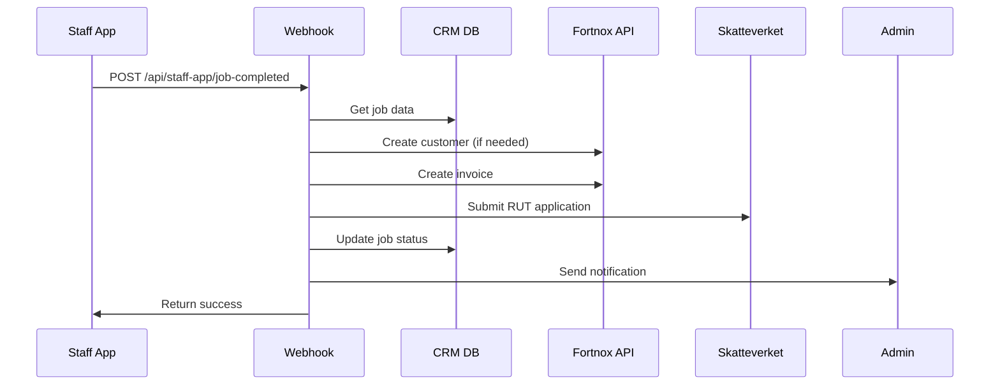

# 📊 Fortnox Auto-Invoice Integration Documentation

## Overview
This document describes the Fortnox Auto-Invoice System integrated with Nordflytt CRM, enabling automatic invoice creation with detailed RUT reporting when Staff App jobs are completed.

## 🏗️ System Architecture

### Components
1. **Fortnox Integration Library** (`/lib/fortnox-integration.ts`)
   - Main integration class `NordflyttFortnoxIntegration`
   - Handles invoice creation, customer management, and RUT applications
   - Singleton pattern for consistent API connection

2. **Staff App Webhook** (`/app/api/staff-app/job-completed/route.ts`)
   - Receives job completion data from Staff App
   - Triggers auto-invoice creation
   - Updates job status and notifies admin

3. **Enhanced Ekonomi & AI Dashboard** (`/app/crm/ekonomi/page.tsx`)
   - Auto-invoice metrics display
   - Invoice details modal with RUT breakdown
   - Settings configuration panel

4. **UI Components**
   - `AutoInvoiceCard.tsx` - Dashboard metrics display
   - `InvoiceDetailsModal.tsx` - Detailed invoice view
   - `AutoInvoiceMonitoring.tsx` - Error monitoring dashboard

## 📋 Workflow

### 1. Job Completion Flow


### 2. Data Flow
- **Input**: Job completion data with actual hours worked
- **Processing**: Calculate RUT deductions, create invoice rows
- **Output**: Fortnox invoice number and RUT application ID

## 🔧 Configuration

### Environment Variables
```bash
# Fortnox API Credentials
FORTNOX_CLIENT_ID=your_client_id
FORTNOX_CLIENT_SECRET=your_client_secret
FORTNOX_ACCESS_TOKEN=your_access_token

# Auto-Invoice Settings
ENABLE_AUTO_INVOICE=true
AUTO_SEND_INVOICES=false
AUTO_INVOICE_RETRY_ATTEMPTS=3
```

### Default Article Numbers
- Flytthjälp: `2`
- Packning: `3`
- Städning: `4`
- Övriga tjänster: `99`
- Material articles: `101-106`

## 📊 RUT Calculation

### Eligible Services
- **MOVINGSERVICES**: Flytthjälp, Packning
- **CLEANING**: Städning
- **CONSTRUCTION**: Montering
- **ELECTRICITY**: Elektriker
- **HVAC**: VVS

### Calculation Formula
```javascript
laborCost = hours * 450 // SEK per hour (before RUT)
rutAmount = Math.floor(laborCost * 0.5) // 50% RUT deduction
customerPrice = totalPrice - rutAmount
```

### Example RUT Breakdown
```
Service: Flytthjälp
Hours: 80h (4 staff × 20h each)
Labor cost: 80h × 450 kr/h = 36,000 kr
RUT deduction: 36,000 × 50% = 18,000 kr
Customer pays: 36,000 - 18,000 = 18,000 kr
```

## 🚨 Error Handling

### Error Types
1. **Fortnox Connection Errors**
   - Network timeouts
   - Invalid credentials
   - API rate limits

2. **Customer Data Errors**
   - Missing personal number
   - Invalid address format
   - Duplicate customers

3. **RUT Calculation Errors**
   - Missing staff hours
   - Invalid service types
   - Exceeding RUT limits

4. **Staff App Data Errors**
   - Incomplete job data
   - Missing service breakdown
   - Invalid timestamps

### Retry Logic
- Automatic retry up to 3 times
- Exponential backoff: 1s, 5s, 30s
- Failed invoices logged for manual review
- Admin notifications on persistent failures

## 📈 Monitoring

### Dashboard Metrics
- **Success Rate**: Percentage of successful auto-invoices
- **Processing Time**: Average time from completion to invoice
- **RUT Applications**: Pending/approved status
- **Staff Hours**: Total tracked hours per period

### Error Monitoring
- Real-time error tracking
- Error type breakdown
- Resolution time metrics
- Manual retry options

## 🧪 Testing

### Test Scenarios
1. **Happy Path**
   ```javascript
   // Complete job with all data
   POST /api/staff-app/job-completed
   {
     jobId: "job_12345",
     completedAt: "2025-01-21T10:30:00Z",
     actualHours: {
       flytthjälp: 80,
       packning: 60
     },
     // ... full data structure
   }
   ```

2. **Error Scenarios**
   - Missing customer personal number
   - Network failure during invoice creation
   - Invalid RUT service type
   - Exceeded retry attempts

### Test Data
Use existing test customer:
- Name: Anna Svensson
- Email: anna.svensson@gmail.com
- Personal Number: 780321-6006

## 🔐 Security

### API Security
- Bearer token authentication for Fortnox
- Client secret in headers
- HTTPS only communication
- Environment variables for credentials

### Data Privacy
- Personal numbers encrypted at rest
- Audit trail for all operations
- GDPR compliant data handling
- Secure webhook endpoints

## 📝 Business Rules

### Invoice Creation Rules
1. Only create invoice if job status is "completed"
2. Require minimum 1 hour of tracked time
3. Include all services with actual hours > 0
4. Add materials as non-RUT eligible items
5. Apply standard payment terms (30 days)

### RUT Application Rules
1. Only submit if customer has personal number
2. Maximum 50% deduction on labor costs
3. Annual limit per customer: 50,000 SEK
4. Exclude material costs from RUT
5. Include detailed hour breakdown

## 🛠️ Troubleshooting

### Common Issues

#### Invoice Not Created
1. Check `ENABLE_AUTO_INVOICE=true` in environment
2. Verify Fortnox credentials are valid
3. Check job has completed status
4. Review error logs in monitoring dashboard

#### RUT Application Failed
1. Verify customer personal number format
2. Check service type is RUT-eligible
3. Ensure hours are tracked correctly
4. Verify annual limit not exceeded

#### Duplicate Invoices
1. Check webhook idempotency
2. Verify job status updates
3. Review retry logic timing
4. Check for race conditions

### Debug Endpoints
- `GET /api/staff-app/job-completed` - Health check
- `GET /api/financial/auto-invoice-stats` - Metrics
- `GET /api/financial/error-logs` - Error history

## 🚀 Future Enhancements

### Planned Features
1. **Batch Invoice Processing**
   - Process multiple completions at once
   - Optimize API calls
   - Reduce processing time

2. **Advanced RUT Optimization**
   - ML-based RUT maximization
   - Customer annual limit tracking
   - Service recommendation engine

3. **Real-time Notifications**
   - WebSocket updates for invoice status
   - Push notifications for errors
   - Customer invoice delivery tracking

4. **Analytics Dashboard**
   - Revenue attribution by source
   - Staff productivity metrics
   - RUT utilization analysis

## 📞 Support

### Technical Support
- Email: tech@nordflytt.se
- Slack: #fortnox-integration
- On-call: +46 8 123 456 78

### Business Support
- Email: support@nordflytt.se
- Documentation: This file
- Training videos: Available on request

---

**Last Updated**: 2025-01-21
**Version**: 1.0.0
**Status**: Production Ready