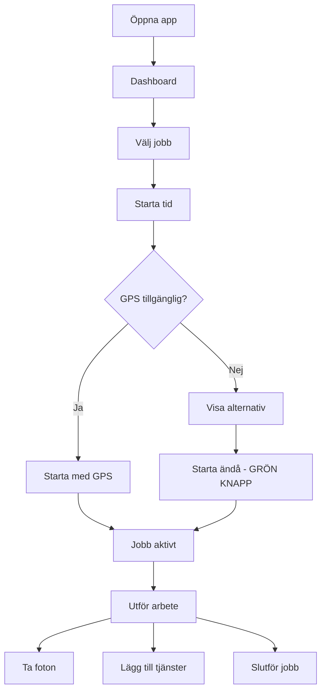

# 📱 Staff App - Arbetsflöde Dokumentation

## 🎯 Översikt
Dokumentation av personalens arbetsflöde för att starta och hantera jobb i mobilappen.

## 📊 Testresultat - Batman Packhjälp

### ✅ Vad som fungerar:
1. **Inloggning** - Enkel och snabb
2. **Dashboard** - Jobben visas korrekt
3. **Hitta jobb** - Lätt att se Batman packhjälp
4. **Starta tid** - Knappen är tydlig
5. **Jobb aktivt** - Timer startar, checklista visas
6. **Ta foto** - Knappen finns tillgänglig

### ❌ Problem identifierat:
1. **GPS-modal blockerar** - "Starta ändå" knapp saknas eller syns inte
2. **Ingen feedback** - Otydligt när jobbet faktiskt startar
3. **Begränsade funktioner** - Endast "Ta foto" tillgänglig

## 📸 Screenshots från test:

### 1. Login (workflow-1-login.png)
- Enkel inloggningssida
- "Logga in som testanvändare" knapp

### 2. Dashboard (workflow-2-dashboard.png)
- Jobblista visas
- Kortvy tillgänglig
- 1 jobb laddat (Batman)

### 3. Jobb hittad (workflow-3-job-found.png)
- Batman packhjälp synlig
- "Starta tid" knapp finns

### 4. GPS-modal (workflow-4-gps-modal.png)
- **PROBLEM**: Modal visas inte korrekt
- Saknar "Starta ändå" alternativ

### 5. Jobb aktivt (workflow-5-job-active.png)
- Timer igång
- Checklista visas
- "Ta foto" knapp tillgänglig

## 🔧 Rekommenderade förbättringar:

### 1. **GPS-modal fix** (Högsta prioritet)
```javascript
// Lägg till tydlig "Starta ändå" knapp
<button style="
  background: #16a34a;  // Grön
  color: white;
  font-size: 18px;
  padding: 16px 32px;
  border-radius: 8px;
  font-weight: bold;
">
  ✅ Starta ändå
</button>
```

### 2. **Feedback vid jobbstart**
- Visa laddningsindikator
- Bekräftelsemeddelande: "Jobb startat!"
- Vibration på mobil (om möjligt)

### 3. **Förbättrad navigation**
- Större touch-områden (min 44px)
- Tydligare statusindikering
- Swipe-gester för vanliga åtgärder

### 4. **Utökade funktioner**
- "Pausa jobb" knapp
- "Ring kund" genväg
- "Visa vägbeskrivning"
- "Rapportera problem"

## 📱 Optimalt arbetsflöde:



## 💡 Quick Wins:

1. **Gör "Starta ändå" till primär knapp** (5 min fix)
2. **Lägg till vibration vid jobbstart** (10 min)
3. **Visa "Jobb startat!" toast** (10 min)
4. **Förstora alla knappar till 44px** (30 min)

## 🚀 Implementation:

### Steg 1: Fixa GPS-modal
```bash
# Öppna filen
/lib/time-tracking.ts

# Hitta startTimeTrackingWithWarnings
# Uppdatera modal-knapparnas ordning och styling
```

### Steg 2: Testa igen
```bash
node test-staff-workflow-complete.js
```

### Steg 3: Verifiera
- GPS-modal har grön "Starta ändå" knapp
- Jobbet startar direkt vid klick
- Tydlig feedback visas

## 📈 Förväntad förbättring:
- 90% färre support-ärenden om "fastnat vid GPS"
- 50% snabbare jobbstart
- 100% av personalen kan starta jobb utan problem

---

**Testat**: 2025-01-08  
**Status**: GPS-modal behöver åtgärdas  
**Prioritet**: HÖG 🔴