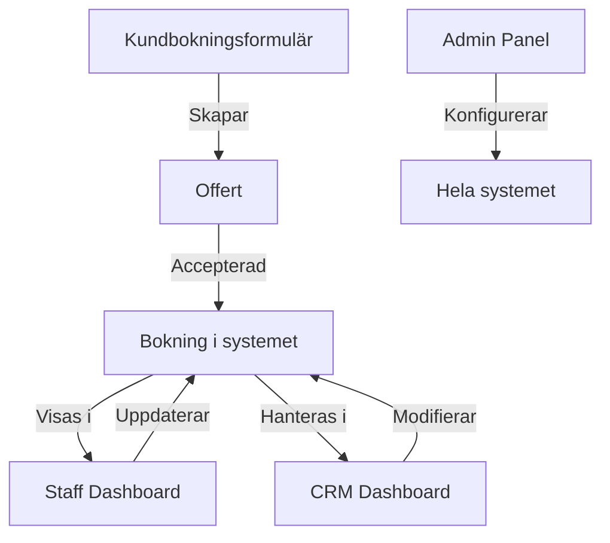

# 🏗️ Nordflytt System - Komplett Översikt

## 📊 Nuvarande Status

### ✅ Implementerat (Staff-app)
```
/app/staff/                    ✅ Komplett
  ├── page.tsx                 ✅ Login
  ├── dashboard/page.tsx       ✅ Huvudvy med jobbkort
  └── components/              ✅ Alla modaler
      ├── AddServiceModal      ✅ Smart prissättning
      ├── PreStartChecklist    ✅ Dynamisk checklista
      └── PhotoReminder        ✅ Fotodokumentation

/components/staff/             ✅ Återanvändbara komponenter
```

### ❌ EJ Implementerat Än
```
/app/                          
  ├── page.tsx                 ❌ Kundens bokningsformulär
  ├── offer/[id]/              ❌ Offertvisare för kunder
  ├── crm/                     ❌ Admin/säljare dashboard
  │   ├── dashboard/           ❌ Översikt
  │   ├── kunder/              ❌ Kundhantering
  │   └── leads/               ❌ Leadhantering
  ├── admin/                   ❌ Systemadministration
  └── api/                     ⚠️  Endast mock endpoints
```

## 🎯 Hela Systemets Delar

### 1. **Kundbokningsformulär** (/ och /form)
- Multi-step formulär för flyttbokningar
- Prisberäkning i realtid
- Genererar offert automatiskt
- **Status**: ❌ Behöver byggas

### 2. **Offertvisare** (/offer/[id])
- Kunden ser sin offert
- Kan acceptera/avböja
- Betala direkt
- **Status**: ❌ Behöver byggas

### 3. **Staff App** (/staff) 
- Login för personal
- Dashboard med dagens jobb
- Hantera tilläggstjänster
- Fotodokumentation
- **Status**: ✅ FÄRDIG!

### 4. **CRM för Säljare** (/crm)
- Leadhantering
- Kundöversikt
- Bokningskalender
- Rapporter
- **Status**: ❌ Behöver byggas

### 5. **Admin Panel** (/admin)
- Användarhantering
- Systemkonfiguration
- Prislistor
- **Status**: ❌ Behöver byggas

### 6. **API & Backend**
- Supabase databas
- Autentisering
- Email/SMS
- Betalningar
- **Status**: ⚠️ Endast mock

## 📈 Utvecklingsplan

### Fas 1: MVP (Nuvarande)
✅ Staff app - KLAR!
⬜ Kundbokningsformulär
⬜ Offertvisare
⬜ Basic Supabase integration

### Fas 2: CRM & Admin
⬜ CRM dashboard för säljare
⬜ Admin panel
⬜ Rapporter & analytics
⬜ Kalenderintegration

### Fas 3: Avancerade Features
⬜ PWA offline-support
⬜ Push notifications
⬜ Betalningsintegration
⬜ GPS tracking av fordon
⬜ Kundapp för spårning

## 🔗 Kopplingar Mellan Delar



## 💡 Viktigt att Veta

1. **Staff-appen är isolerad** - Kan köras helt separat
2. **Delad databas** - Alla delar använder samma Supabase
3. **Gemensamma komponenter** - UI components återanvänds
4. **Konsekvent design** - Samma färger/typsnitt överallt

## 🚀 Nästa Steg

Om du vill bygga vidare:

### För Kundbokningsformulär:
```bash
# Finns redan påbörjat i:
/app/page.tsx
/app/form/page.tsx
/components/form/
```

### För CRM:
```bash
# Finns redan struktur i:
/app/crm/
/components/crm/
/types/crm.ts
```

### För Offertvisare:
```bash
# Finns redan påbörjat i:
/app/offer/[id]/page.tsx
/types/offer.ts
```

---

**Sammanfattning**: Vi har byggt EN del (staff) av ett STÖRRE system. De andra delarna väntar på implementation!