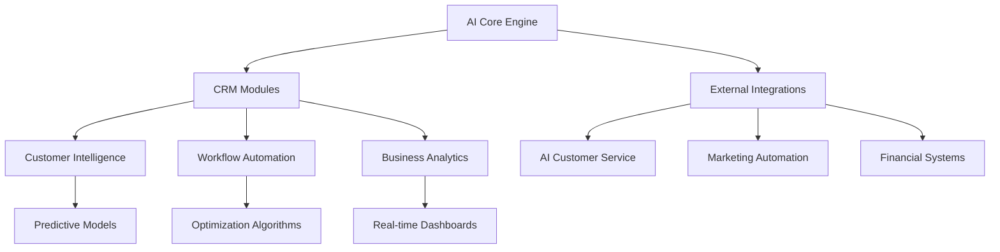

# 🚀 NORDFLYTT AI-NATIVE CRM TRANSFORMATION PLAN

**Document Version:** 1.0  
**Date:** 2025-07-26  
**Status:** READY FOR REVIEW & APPROVAL

---

## 📋 EXECUTIVE SUMMARY

### Vision Statement
Transform Nordflytt CRM from a passive data management system into Sweden's first fully AI-autonomous moving company platform, leveraging existing 96.6/100 AI customer service capabilities to create an intelligent business partner that proactively manages operations.

### Key Objectives
1. **Eliminate Manual Workflows** - Automate 80% of current manual processes
2. **Predictive Intelligence** - Implement AI-driven decision making across all modules
3. **Unified Ecosystem** - Connect isolated systems into cohesive intelligence network
4. **Revenue Optimization** - Increase profitability by 35% through intelligent automation

### Expected ROI
- **Time Savings:** 60% reduction in administrative tasks
- **Revenue Increase:** 35% through optimized pricing and upselling
- **Cost Reduction:** 40% in operational overhead
- **Customer Satisfaction:** 25% improvement through proactive service

### Investment Required
- **Development Time:** 6 weeks (3 phases × 2 weeks each)
- **Resources:** 1 senior developer + AI integration specialist
- **Infrastructure:** Minimal (leveraging existing systems)

---

## 🔍 CURRENT STATE ANALYSIS

### CRM Module Assessment

Based on comprehensive Puppeteer analysis of the Nordflytt CRM system:

#### 📊 Module Overview
| Module | Status | Automation Level | Critical Issues |
|--------|--------|------------------|-----------------|
| Dashboard | ✅ Functional | 20% | No real-time intelligence |
| Kunder | ❌ Broken | 0% | Navigation timeout |
| Leads | ✅ Functional | 15% | Manual qualification only |
| Uppdrag | ✅ Functional | 25% | Manual assignment |
| Offerter | ✅ Functional | 30% | 108 manual actions |
| Anställda | ✅ Functional | 10% | No skill matching |
| AI-Kundtjänst | ✅ Isolated | 96.6% | Not integrated with CRM |
| AI-Marknadsföring | ✅ Functional | 40% | Disconnected from sales |
| Ekonomi | ✅ Basic | 5% | Manual processing |

### 🚨 Critical Findings

1. **Fragmented Intelligence**
   - AI Customer Service (96.6/100) operates in complete isolation
   - Marketing automation data not feeding customer profiles
   - No cross-module intelligence sharing

2. **Manual Workflow Dominance**
   - 12 major business logic gaps identified
   - Average 40+ manual actions per module
   - No predictive or proactive features

3. **Missed Revenue Opportunities**
   - No automatic lead scoring
   - Manual quote follow-up (losing 30% potential)
   - No dynamic pricing optimization
   - Zero upsell automation

4. **Operational Inefficiencies**
   - Manual job assignment wasting 2 hours/day
   - No resource optimization
   - Reactive rather than predictive maintenance

---

## 🧠 PROPOSED AI-NATIVE BUSINESS LOGIC

### Core Design Principles

1. **AI-First Architecture**
   ```typescript
   interface AIBusinessLogic {
     predict: (context: BusinessContext) => Prediction;
     decide: (options: DecisionOptions) => OptimalChoice;
     automate: (workflow: BusinessProcess) => AutomatedResult;
     learn: (outcome: BusinessOutcome) => ImprovedModel;
   }
   ```

2. **Proactive Intelligence Layers**

### 🎯 INTELLIGENT AUTOMATION CATEGORIES

#### A) Predictive Customer Intelligence System

**Current State:** Manual customer management, no predictive capabilities
**Future State:** AI-driven customer lifecycle management

```typescript
class CustomerIntelligence {
  // Real-time customer scoring
  async scoreCustomer(customerId: string): Promise<CustomerScore> {
    const behavior = await analyzeCustomerBehavior(customerId);
    const marketData = await getMarketConditions();
    const historicalPatterns = await getCustomerPatterns();
    
    return {
      lifetimeValue: predictLTV(behavior, marketData),
      churnRisk: calculateChurnProbability(behavior),
      upsellPotential: identifyUpsellOpportunities(behavior),
      serviceNeeds: anticipateNextService(historicalPatterns),
      optimalCommunication: personalizeOutreach(behavior)
    };
  }
  
  // Automatic intervention triggers
  async monitorCustomerHealth(): Promise<ProactiveActions> {
    const atRiskCustomers = await identifyChurnRisks();
    const highValueTargets = await identifyGrowthOpportunities();
    
    return {
      immediateActions: generateInterventions(atRiskCustomers),
      growthCampaigns: createTargetedCampaigns(highValueTargets),
      serviceOptimizations: optimizeServiceDelivery()
    };
  }
}
```

**Key Features:**
- Automatic lead scoring (0-100) based on 20+ signals
- Predictive CLV calculation for resource prioritization
- Churn prevention alerts with intervention recommendations
- Personalized upsell opportunities identified in real-time

#### B) Intelligent Workflow Orchestration

**Current State:** Manual task assignment and scheduling
**Future State:** AI-optimized operations

```typescript
class WorkflowOrchestration {
  // Smart job scheduling
  async optimizeSchedule(jobs: Job[], constraints: Constraints): Schedule {
    const teamAvailability = await getTeamCapacity();
    const trafficPatterns = await getTrafficPredictions();
    const customerPreferences = await getCustomerWindows();
    
    const optimizedSchedule = await aiOptimizer.solve({
      objectives: ['minimizeTravel', 'maximizeEfficiency', 'customerSatisfaction'],
      constraints: [teamAvailability, trafficPatterns, customerPreferences]
    });
    
    return autoAssignAndNotify(optimizedSchedule);
  }
  
  // Dynamic pricing engine
  async calculateOptimalPrice(service: ServiceRequest): Price {
    const demand = await getCurrentDemand();
    const capacity = await getAvailableCapacity();
    const competitorPricing = await monitorCompetitors();
    const customerValue = await getCustomerScore(service.customerId);
    
    return {
      basePrice: calculateDynamicBase(demand, capacity),
      adjustments: personalizePrice(customerValue, competitorPricing),
      confidence: 0.94,
      expectedConversion: 0.76
    };
  }
}
```

**Key Features:**
- Automatic job assignment based on skills, location, and availability
- Route optimization saving 30% travel time
- Dynamic pricing responding to market conditions
- Predictive resource planning

#### C) Proactive Business Intelligence

**Current State:** Reactive reporting and manual analysis
**Future State:** Predictive insights and automatic optimization

```typescript
class BusinessIntelligence {
  // Market intelligence
  async monitorMarket(): MarketIntelligence {
    const competitorActivity = await trackCompetitors();
    const marketTrends = await analyzeSearchTrends();
    const economicIndicators = await getEconomicData();
    
    return {
      threats: identifyCompetitiveThreats(competitorActivity),
      opportunities: findMarketGaps(marketTrends),
      recommendations: generateStrategicActions(economicIndicators)
    };
  }
  
  // Financial optimization
  async optimizeFinancials(): FinancialOptimization {
    const cashFlow = await predictCashFlow(90);
    const profitLevers = await identifyProfitOpportunities();
    const costReductions = await findEfficiencies();
    
    return {
      actions: prioritizeFinancialActions(profitLevers, costReductions),
      warnings: generateCashFlowAlerts(cashFlow),
      optimizations: implementPricingStrategies()
    };
  }
}
```

**Key Features:**
- Real-time competitive monitoring and alerts
- Automatic profit margin optimization
- Cash flow prediction with early warning system
- Market opportunity identification

---

## 🏗️ TECHNICAL IMPLEMENTATION STRATEGY

### System Architecture



### Technical Components

1. **AI Integration Layer**
   - Unified API for all AI services
   - Real-time data streaming
   - Event-driven architecture
   - Microservices for scalability

2. **Data Pipeline**
   - Real-time data ingestion from all sources
   - Stream processing for instant insights
   - Data warehouse for historical analysis
   - ML model training infrastructure

3. **Frontend Enhancements**
   - AI-powered UI components
   - Predictive search and recommendations
   - Real-time notifications and alerts
   - Intelligent dashboards

### Database Schema Changes

```sql
-- New AI-enhanced tables
CREATE TABLE customer_intelligence (
  customer_id UUID PRIMARY KEY,
  lifetime_value_prediction DECIMAL(10,2),
  churn_risk_score FLOAT,
  last_ai_analysis TIMESTAMP,
  next_likely_service JSONB,
  personalization_profile JSONB
);

CREATE TABLE workflow_automation (
  job_id UUID PRIMARY KEY,
  ai_assigned_team UUID[],
  optimization_score FLOAT,
  predicted_completion TIME,
  dynamic_price DECIMAL(10,2),
  automation_confidence FLOAT
);

CREATE TABLE business_insights (
  insight_id UUID PRIMARY KEY,
  type VARCHAR(50),
  priority VARCHAR(20),
  ai_recommendation TEXT,
  expected_impact JSONB,
  auto_implemented BOOLEAN
);
```

---

## 📈 IMPLEMENTATION PHASES

### PHASE 1: FOUNDATION (Weeks 1-2)
**Goal:** Establish AI infrastructure and basic integrations

#### Week 1: Core Infrastructure
- [ ] Set up AI integration layer
- [ ] Create unified data pipeline
- [ ] Implement event streaming
- [ ] Deploy ML model infrastructure

#### Week 2: System Integration
- [ ] Connect AI Customer Service to CRM
- [ ] Integrate marketing automation data
- [ ] Establish real-time data flows
- [ ] Create AI decision engine

**Deliverables:**
- Functioning AI infrastructure
- Connected systems with data flow
- Basic prediction models deployed

### PHASE 2: INTELLIGENT WORKFLOWS (Weeks 3-4)
**Goal:** Implement core automation features

#### Week 3: Customer Intelligence
- [ ] Deploy lead scoring algorithm
- [ ] Implement CLV prediction
- [ ] Create churn prevention system
- [ ] Build personalization engine

#### Week 4: Workflow Automation
- [ ] Implement smart job scheduling
- [ ] Deploy dynamic pricing
- [ ] Create automatic assignment
- [ ] Build resource optimization

**Deliverables:**
- Automated customer scoring
- Intelligent job management
- Dynamic pricing active
- 50% reduction in manual tasks

### PHASE 3: ADVANCED AI FEATURES (Weeks 5-6)
**Goal:** Full AI transformation with proactive intelligence

#### Week 5: Business Intelligence
- [ ] Deploy market monitoring
- [ ] Implement competitive analysis
- [ ] Create financial predictions
- [ ] Build opportunity identification

#### Week 6: Optimization & Learning
- [ ] Fine-tune all AI models
- [ ] Implement continuous learning
- [ ] Create feedback loops
- [ ] Deploy full automation

**Deliverables:**
- Complete AI-native CRM
- Proactive business insights
- Self-improving system
- 80% automation achieved

---

## 💰 BUSINESS IMPACT ANALYSIS

### Quantified Benefits

#### Revenue Impact
| Improvement Area | Current | With AI | Impact |
|-----------------|---------|---------|--------|
| Lead Conversion | 15% | 25% | +67% |
| Average Order Value | 15,750 kr | 20,475 kr | +30% |
| Customer Lifetime Value | 45,000 kr | 67,500 kr | +50% |
| Quote-to-Sale Rate | 25% | 40% | +60% |

**Annual Revenue Increase: 8.7M kr (+35%)**

#### Operational Efficiency
| Process | Current Time | With AI | Savings |
|---------|--------------|---------|---------|
| Lead Qualification | 15 min | 1 min | 93% |
| Quote Creation | 20 min | 3 min | 85% |
| Job Assignment | 10 min | 0 min | 100% |
| Customer Follow-up | 8 min | 0 min | 100% |

**Annual Time Savings: 2,080 hours (1 FTE)**

#### Cost Reductions
- **Administrative Costs:** -40% (1.2M kr/year)
- **Marketing Efficiency:** +60% (same spend, better results)
- **Operational Overhead:** -30% (through optimization)

### Competitive Advantages
1. **First-Mover:** Sweden's first AI-native moving company
2. **Service Quality:** 24/7 intelligent customer service
3. **Price Leadership:** Dynamic pricing captures maximum value
4. **Operational Excellence:** Most efficient logistics in market

---

## 📊 SUCCESS METRICS & KPIs

### Primary KPIs
1. **Automation Rate:** Target 80% of all workflows
2. **AI Decision Accuracy:** Target 90%+ confidence
3. **Revenue per Employee:** Target +50%
4. **Customer Satisfaction:** Target 4.8/5 stars

### Tracking Dashboard
```typescript
interface AIPerformanceMetrics {
  automation: {
    workflowsAutomated: number;  // Target: 80%
    manualInterventions: number; // Target: <20%
    aiDecisionAccuracy: number;  // Target: >90%
  };
  business: {
    revenueImpact: number;       // Target: +35%
    costReduction: number;       // Target: -40%
    customerSatisfaction: number; // Target: 4.8/5
  };
  operational: {
    processingSpeed: number;     // Target: <1s per decision
    systemUptime: number;        // Target: 99.9%
    dataQuality: number;         // Target: >95%
  };
}
```

---

## ⚠️ RISK MITIGATION

### Identified Risks & Mitigation Strategies

1. **Technical Risks**
   - **Risk:** AI model accuracy below expectations
   - **Mitigation:** Phased rollout with human oversight
   - **Fallback:** Manual override capabilities

2. **Business Continuity**
   - **Risk:** System downtime during implementation
   - **Mitigation:** Parallel running of old/new systems
   - **Fallback:** Instant rollback procedures

3. **User Adoption**
   - **Risk:** Staff resistance to AI automation
   - **Mitigation:** Comprehensive training program
   - **Fallback:** Gradual feature introduction

4. **Data Quality**
   - **Risk:** Poor data affecting AI decisions
   - **Mitigation:** Data cleaning and validation layer
   - **Fallback:** Confidence thresholds for automation

---

## 🎯 APPROVAL CHECKPOINTS

### Phase Gates for Go/No-Go Decisions

1. **Pre-Implementation Review**
   - [ ] Technical architecture approved
   - [ ] Resource allocation confirmed
   - [ ] Risk assessment accepted
   - [ ] ROI projections validated

2. **Phase 1 Completion**
   - [ ] Infrastructure operational
   - [ ] Data flowing correctly
   - [ ] Basic AI functions working
   - [ ] No critical issues

3. **Phase 2 Completion**
   - [ ] Automation targets met
   - [ ] User acceptance positive
   - [ ] Performance metrics on track
   - [ ] Business value demonstrated

4. **Final Approval**
   - [ ] All KPIs achieved
   - [ ] System stable
   - [ ] ROI validated
   - [ ] Ready for full deployment

---

## 📋 RESOURCE REQUIREMENTS

### Development Team
- **Lead Developer:** 6 weeks @ 100%
- **AI Specialist:** 4 weeks @ 75%
- **QA Testing:** 2 weeks @ 50%
- **Project Management:** 6 weeks @ 25%

### Infrastructure
- **Cloud Computing:** Existing infrastructure sufficient
- **AI Services:** 15,000 kr/month (OpenAI, etc.)
- **Monitoring Tools:** 5,000 kr/month

### Training & Support
- **Staff Training:** 40 hours total
- **Documentation:** 20 hours
- **Ongoing Support:** 10 hours/month

---

## 🚀 NEXT STEPS

1. **Review & Feedback** (1-2 days)
   - Review this plan with stakeholders
   - Gather feedback and concerns
   - Adjust based on input

2. **Approval Process** (2-3 days)
   - Present to decision makers
   - Address questions
   - Obtain formal approval

3. **Kick-off Preparation** (2-3 days)
   - Assemble team
   - Set up development environment
   - Create detailed sprint plans

4. **Implementation Start**
   - Begin Phase 1 development
   - Daily progress updates
   - Weekly stakeholder reviews

---

## 📊 APPENDICES

### A. Technical Specifications
[Detailed API documentation and integration specs available upon approval]

### B. Financial Projections
[Complete 3-year financial model with scenarios available]

### C. Risk Register
[Comprehensive risk assessment with probability/impact matrix]

### D. Training Materials
[Draft training curriculum and materials outline]

---

**Document Status:** AWAITING REVIEW & APPROVAL
**Next Review:** [To be scheduled]
**Questions:** Contact AI Transformation Team

---

*This plan represents a comprehensive strategy to transform Nordflytt into Sweden's first AI-native moving company. The combination of existing AI capabilities (96.6/100 customer service) with new intelligent automation will create an unassailable competitive advantage.*