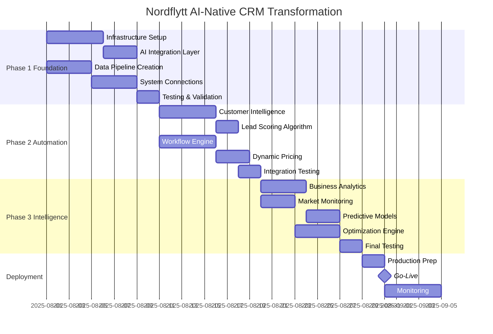
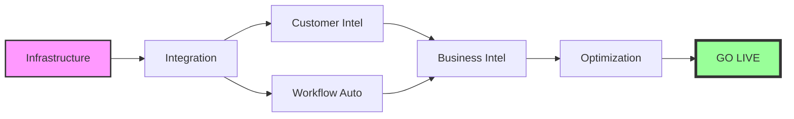

# 📅 IMPLEMENTATION TIMELINE
## Nordflytt AI Transformation Project Schedule

---

## GANTT CHART - 6 WEEK SPRINT



---

## 📋 DETAILED WEEKLY BREAKDOWN

### WEEK 1: FOUNDATION INFRASTRUCTURE
**August 1-7, 2025**

| Day | Activities | Deliverables | Resources |
|-----|-----------|--------------|-----------|
| Mon | • Kick-off meeting<br>• Environment setup<br>• Architecture review | Project charter signed | Full team |
| Tue | • AI integration layer design<br>• Data pipeline architecture<br>• Security audit | Technical specs approved | Dev + AI specialist |
| Wed | • Begin infrastructure build<br>• Set up cloud resources<br>• Configure APIs | Dev environment ready | Dev team |
| Thu | • Connect AI customer service<br>• Implement data streaming<br>• Create event bus | Base connections live | Dev + Integration |
| Fri | • Testing framework<br>• Initial integration tests<br>• Documentation | Week 1 demo ready | Full team |

**Key Milestone:** ✅ AI Infrastructure Operational

---

### WEEK 2: SYSTEM INTEGRATION
**August 8-14, 2025**

| Day | Activities | Deliverables | Resources |
|-----|-----------|--------------|-----------|
| Mon | • Marketing data integration<br>• CRM module connections<br>• API gateway setup | All systems connected | Dev team |
| Tue | • Real-time data flows<br>• Event processing<br>• Data validation | Streaming operational | Dev + Data eng |
| Wed | • ML model deployment<br>• Training pipeline<br>• Model versioning | Base models live | AI specialist |
| Thu | • End-to-end testing<br>• Performance optimization<br>• Security validation | Integration complete | Full team |
| Fri | • Phase 1 review<br>• Stakeholder demo<br>• Go/no-go decision | Phase 1 approved | All stakeholders |

**Key Milestone:** ✅ All Systems Integrated & Flowing

---

### WEEK 3: CUSTOMER INTELLIGENCE
**August 15-21, 2025**

| Day | Activities | Deliverables | Resources |
|-----|-----------|--------------|-----------|
| Mon | • Lead scoring algorithm<br>• Historical data analysis<br>• Model training | Scoring model v1 | AI specialist |
| Tue | • CLV prediction model<br>• Customer segmentation<br>• Behavior analysis | CLV model deployed | AI + Analytics |
| Wed | • Churn prediction<br>• Risk scoring<br>• Alert system | Churn system live | AI specialist |
| Thu | • Personalization engine<br>• Recommendation system<br>• A/B test framework | Personalization active | Dev + AI |
| Fri | • Integration testing<br>• UI updates<br>• User training | Customer intel complete | Full team |

**Key Milestone:** ✅ Intelligent Customer Management Active

---

### WEEK 4: WORKFLOW AUTOMATION
**August 22-28, 2025**

| Day | Activities | Deliverables | Resources |
|-----|-----------|--------------|-----------|
| Mon | • Smart scheduling engine<br>• Route optimization<br>• Capacity planning | Scheduler deployed | Dev team |
| Tue | • Team assignment AI<br>• Skill matching<br>• Performance tracking | Auto-assignment live | Dev + Ops |
| Wed | • Dynamic pricing engine<br>• Market analysis<br>• Competition monitoring | Pricing AI active | AI + Business |
| Thu | • Resource optimization<br>• Predictive maintenance<br>• Inventory management | Full automation suite | Dev team |
| Fri | • Phase 2 review<br>• Performance metrics<br>• User feedback | Phase 2 complete | All stakeholders |

**Key Milestone:** ✅ 50% Automation Achieved

---

### WEEK 5: BUSINESS INTELLIGENCE
**September 1-7, 2025**

| Day | Activities | Deliverables | Resources |
|-----|-----------|--------------|-----------|
| Mon | • Market monitoring setup<br>• Competitor tracking<br>• Trend analysis | Market intel live | AI + Analytics |
| Tue | • Financial predictions<br>• Cash flow modeling<br>• Profit optimization | Financial AI active | AI + Finance |
| Wed | • Opportunity identification<br>• Growth modeling<br>• Strategic recommendations | Growth engine live | AI specialist |
| Thu | • Executive dashboards<br>• Real-time reporting<br>• Alert systems | BI suite complete | Dev + UX |
| Fri | • Advanced testing<br>• Stress testing<br>• Security audit | System validated | Full team |

**Key Milestone:** ✅ Proactive Intelligence Operational

---

### WEEK 6: OPTIMIZATION & LAUNCH
**September 8-14, 2025**

| Day | Activities | Deliverables | Resources |
|-----|-----------|--------------|-----------|
| Mon | • Model fine-tuning<br>• Performance optimization<br>• Final integrations | Optimized system | AI specialist |
| Tue | • User acceptance testing<br>• Training sessions<br>• Documentation | UAT complete | Full team |
| Wed | • Production preparation<br>• Deployment planning<br>• Rollback procedures | Launch ready | Dev + Ops |
| Thu | • Go-live execution<br>• Monitoring setup<br>• Support preparation | **SYSTEM LIVE** | All hands |
| Fri | • Post-launch review<br>• Metrics analysis<br>• Celebration! | Project complete | Everyone |

**Key Milestone:** 🚀 **AI-NATIVE CRM TRANSFORMATION COMPLETE**

---

## 🎯 CRITICAL PATH & DEPENDENCIES



### Critical Dependencies:
1. **Infrastructure MUST be complete** before any AI features
2. **Data pipeline required** for all intelligence features
3. **Customer Intel + Workflow** can run in parallel
4. **Business Intelligence** requires both streams complete
5. **2-day buffer** before go-live for safety

---

## 📊 RESOURCE ALLOCATION

### Team Utilization Chart
```
Week 1: ████████████████████ 100% - All hands
Week 2: ████████████████░░░░ 80%  - Focus on integration
Week 3: ████████████░░░░░░░░ 60%  - AI specialist lead
Week 4: ████████████████░░░░ 80%  - Dev team heavy
Week 5: ████████████░░░░░░░░ 60%  - Analytics focus
Week 6: ████████████████████ 100% - Launch preparation
```

### Skill Requirements by Phase:
- **Phase 1:** Backend Dev (80%), DevOps (20%)
- **Phase 2:** AI/ML (60%), Frontend (40%)
- **Phase 3:** Business Analysis (50%), Testing (50%)

---

## ✅ QUALITY GATES

### Weekly Checkpoints:
- **Monday:** Week plan review & resource confirmation
- **Wednesday:** Mid-week progress check & blocker resolution
- **Friday:** Demo, metrics review & go/no-go decision

### Success Criteria by Week:
1. **Week 1:** All systems connected, data flowing
2. **Week 2:** Base AI models deployed and working
3. **Week 3:** Customer features live with >90% accuracy
4. **Week 4:** Automation achieving 50% target
5. **Week 5:** All intelligence features operational
6. **Week 6:** System stable, users trained, 80% automation

---

## 🚨 RISK MITIGATION TIMELINE

| Week | Primary Risk | Mitigation | Contingency |
|------|-------------|------------|-------------|
| 1 | Infrastructure delays | Parallel work streams | Cloud backup plan |
| 2 | Integration failures | Extensive testing | Gradual rollout |
| 3 | Model accuracy issues | Human oversight | Manual override |
| 4 | User resistance | Training & support | Phased adoption |
| 5 | Performance problems | Load testing | Scale resources |
| 6 | Launch issues | Rollback plan | Parallel running |

---

*This timeline ensures systematic transformation with minimal risk and maximum value delivery.*