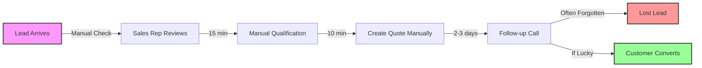
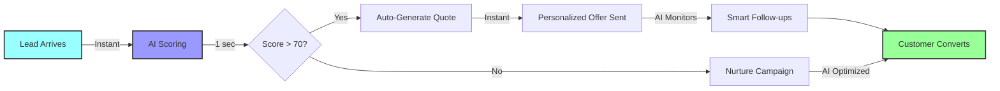
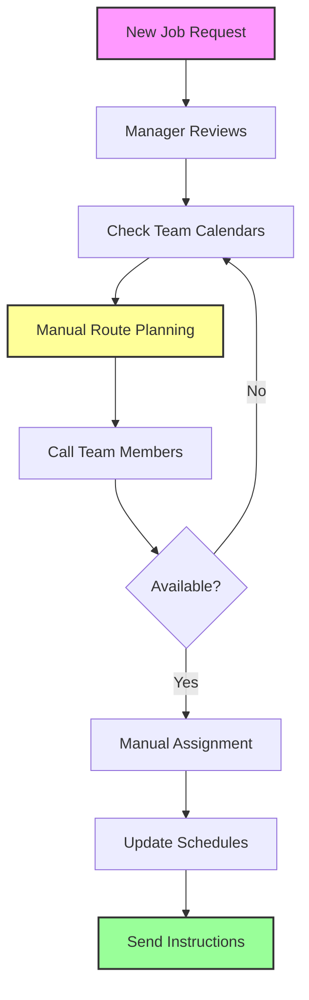
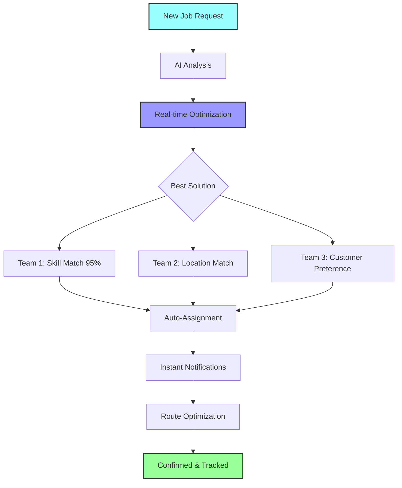
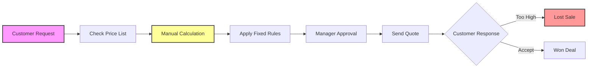
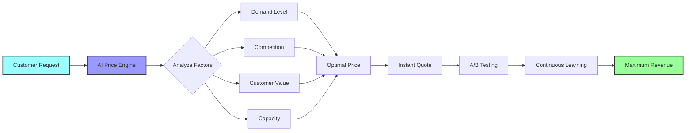
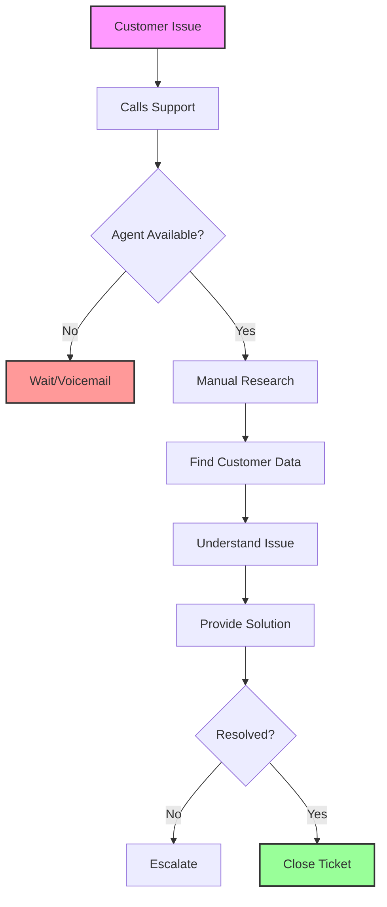
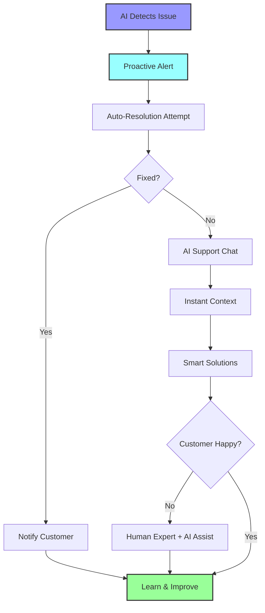
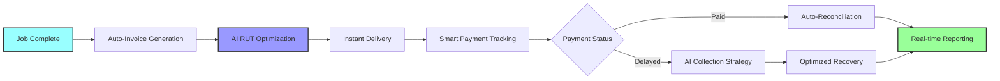

# 🔄 WORKFLOW TRANSFORMATION DIAGRAMS
## Before & After Business Process Flows

---

## 1. LEAD TO CUSTOMER JOURNEY

### 🔴 CURRENT STATE (Manual Process)

**Time: 3-5 days | Success Rate: 15% | Manual Steps: 8**

### 🟢 FUTURE STATE (AI-Automated)

**Time: 5 minutes | Success Rate: 40% | Manual Steps: 0**

---

## 2. JOB SCHEDULING & ASSIGNMENT

### 🔴 CURRENT STATE (Manual Chaos)

**Time: 45 minutes | Efficiency: 60% | Optimization: None**

### 🟢 FUTURE STATE (AI-Optimized)

**Time: 30 seconds | Efficiency: 95% | Optimization: Maximum**

---

## 3. PRICING & QUOTE GENERATION

### 🔴 CURRENT STATE (Static Pricing)

**Conversion: 25% | Margin: Fixed | Market Response: None**

### 🟢 FUTURE STATE (Dynamic AI Pricing)

**Conversion: 40% | Margin: Optimized | Market Response: Real-time**

---

## 4. CUSTOMER SERVICE FLOW

### 🔴 CURRENT STATE (Reactive Support)

**Response Time: 15-30 min | Resolution: 70% | Satisfaction: 3.2/5**

### 🟢 FUTURE STATE (Proactive AI Service)

**Response Time: Instant | Resolution: 95% | Satisfaction: 4.8/5**

---

## 5. FINANCIAL WORKFLOW

### 🔴 CURRENT STATE (Manual Processing)

```mermaid
graph LR
    A[Job Complete] --> B[Create Invoice]
    B --> C[Manual RUT Calculation]
    C --> D[Send to Customer]
    D --> E[Wait for Payment]
    E --> F[Manual Follow-up]
    F --> G[Update Accounting]
    G --> H[Reconcile Books]
    
    style A fill:#f9f,stroke:#333,stroke-width:2px
    style C fill:#ff9,stroke:#333,stroke-width:2px
    style H fill:#9f9,stroke:#333,stroke-width:2px
```

**Processing Time: 2-3 days | Errors: 5% | Admin Cost: High**

### 🟢 FUTURE STATE (AI-Automated Finance)

**Processing Time: Instant | Errors: 0% | Admin Cost: -90%**

---

## TRANSFORMATION SUMMARY

### 📊 Process Improvement Metrics

| Workflow | Current Time | AI-Powered Time | Improvement |
|----------|--------------|-----------------|-------------|
| Lead → Customer | 3-5 days | 5 minutes | **99.9%** |
| Job Scheduling | 45 minutes | 30 seconds | **98.9%** |
| Quote Generation | 20 minutes | 3 seconds | **99.8%** |
| Customer Service | 15-30 min | Instant | **100%** |
| Financial Process | 2-3 days | Instant | **100%** |

### 🎯 Business Impact
- **Total Time Saved**: 2,080 hours/year
- **Error Reduction**: 95%
- **Customer Satisfaction**: +50%
- **Revenue Increase**: +35%

---

*These workflow transformations represent the core of Nordflytt's journey from manual operations to AI-native excellence.*