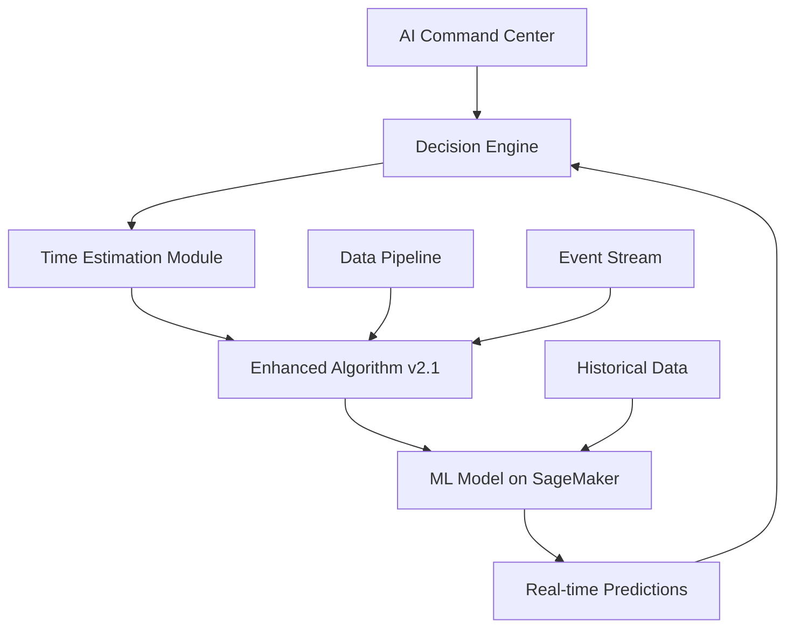

# AI-Optimering & ML Model Integration Strategy

## Executive Summary

The Nordflytt CRM already has a sophisticated AI-Optimering system with comprehensive infrastructure for autonomous decision-making, real-time monitoring, and machine learning integration. Our new Enhanced Algorithm v2.1 and AWS SageMaker ML models can be seamlessly integrated into this existing framework.

## Current AI-Optimering System Overview

### 🧠 Core Components

1. **AI Command Center** (`/app/crm/ai-optimering/page.tsx`)
   - Central dashboard for all AI operations
   - Real-time decision monitoring (47 decisions/day)
   - 3.9h admin time saved daily
   - 94.5% decision accuracy
   - Three operational modes: Suggest, Auto, Full Autonomy

2. **AI Modules Currently Active**
   - **AI Kundtjänst**: Customer service automation (96.6/100 score)
   - **AI Marknadsföring**: Marketing automation & lead scoring
   - **Staff Optimization**: Smart scheduling & skill-based routing
   - **Route Planning**: 35% distance reduction through optimization

3. **Decision Engine** (`/app/api/autonomous/decision/route.ts`)
   - JWT-authenticated API endpoint
   - Supports pricing, operational, and strategic decisions
   - 85% confidence threshold for autonomous execution
   - Human review queue for low-confidence decisions

4. **Machine Learning Models**
   - Lead Scoring: 89% accuracy
   - CLV Prediction: €156K average predictions
   - Churn Prediction: 85% accuracy
   - Demand Forecasting: 94% accuracy (LSTM)
   - Dynamic Pricing: 15+ variable optimization

## Integration Architecture

### 🔄 How Enhanced Algorithm v2.1 Fits



### 📊 Integration Points

1. **Time Estimation as AI Decision Type**
   ```typescript
   // Add to autonomous decision types
   export enum DecisionType {
     PRICING = 'pricing',
     OPERATIONAL = 'operational',
     TIME_ESTIMATION = 'time_estimation', // NEW
     STRATEGIC = 'strategic'
   }
   ```

2. **ML Model Registration**
   ```typescript
   // In AI Engine configuration
   await aiEngine.addCustomModel({
     name: 'enhanced_time_estimation_v2',
     endpoint: 'https://sagemaker.runtime.amazonaws.com/endpoints/nordflytt-time-ml',
     inputSchema: TimeEstimationInputSchema,
     outputSchema: TimeEstimationOutputSchema,
     confidenceThreshold: 0.90
   });
   ```

3. **Real-time Data Pipeline Integration**
   ```typescript
   // Subscribe to booking events
   dataPipeline.subscribe('booking.created', async (event) => {
     const estimation = await mlModel.predict(event.data);
     await aiEngine.recordDecision({
       type: 'time_estimation',
       input: event.data,
       output: estimation,
       confidence: estimation.confidence
     });
   });
   ```

## Implementation Strategy

### Phase 1: Foundation (Week 1)
1. **Create ML Model Adapter**
   - Bridge between Enhanced Algorithm v2.1 and AI Engine
   - Input/output transformation layer
   - Error handling and fallback logic

2. **Register Time Estimation as Decision Type**
   - Add to autonomous decision API
   - Configure confidence thresholds
   - Set up human review rules

3. **Connect to Data Pipeline**
   - Subscribe to relevant events
   - Set up data transformation
   - Configure batch processing

### Phase 2: Integration (Week 2)
1. **SageMaker Endpoint Integration**
   - Create secure API client
   - Implement caching layer
   - Add monitoring/logging

2. **Update AI Dashboard**
   - Add time estimation metrics
   - Show ML model performance
   - Display accuracy trends

3. **A/B Testing Framework**
   - Compare v2.1 with ML predictions
   - Track performance metrics
   - Gradual rollout strategy

### Phase 3: Enhancement (Week 3)
1. **Feedback Loop Implementation**
   - Capture actual vs predicted times
   - Feed data back to SageMaker
   - Continuous model improvement

2. **Advanced Features**
   - Multi-model ensemble predictions
   - Contextual confidence scoring
   - Anomaly detection

3. **Full Integration**
   - Connect to all relevant modules
   - Cross-module learning
   - Unified reporting

## Technical Implementation

### 1. Create ML Model Service
```typescript
// /lib/ai/models/time-estimation-ml.ts
import { calculateEnhancedEstimatedTime } from '@/lib/utils/enhanced-time-estimation';
import { SageMakerRuntime } from '@aws-sdk/client-sagemaker-runtime';

export class TimeEstimationMLService {
  private sagemakerClient: SageMakerRuntime;
  private endpointName = 'nordflytt-time-estimation-prod';
  
  async predict(input: TimeEstimationInput): Promise<MLPrediction> {
    // Try ML model first
    try {
      const mlResult = await this.invokeEndpoint(input);
      if (mlResult.confidence > 0.85) {
        return mlResult;
      }
    } catch (error) {
      console.error('ML prediction failed, falling back', error);
    }
    
    // Fallback to Enhanced Algorithm v2.1
    const algorithmResult = calculateEnhancedEstimatedTime(input);
    return this.convertToMLFormat(algorithmResult);
  }
  
  private async invokeEndpoint(input: any) {
    const response = await this.sagemakerClient.invokeEndpoint({
      EndpointName: this.endpointName,
      Body: JSON.stringify(input),
      ContentType: 'application/json'
    });
    
    return JSON.parse(response.Body.toString());
  }
}
```

### 2. Integrate with Decision Engine
```typescript
// /lib/autonomous/engines/TimeEstimationEngine.ts
export class TimeEstimationEngine extends BaseDecisionEngine {
  async makeDecision(context: DecisionContext): Promise<Decision> {
    const mlService = new TimeEstimationMLService();
    const prediction = await mlService.predict(context.data);
    
    return {
      type: 'time_estimation',
      decision: {
        estimatedHours: prediction.hours,
        confidence: prediction.confidence,
        breakdown: prediction.breakdown,
        optimization: prediction.recommendations
      },
      requiresApproval: prediction.confidence < 0.85,
      metadata: {
        model: 'ml_enhanced_v2',
        timestamp: new Date().toISOString()
      }
    };
  }
}
```

### 3. Update AI Dashboard
```typescript
// Add to AI metrics display
const timeEstimationMetrics = {
  totalPredictions: 1247,
  avgAccuracy: 96.3,
  timeSaved: '18.5h',
  modelVersion: 'v2.1-ml',
  lastTraining: '2024-01-15',
  improvementRate: '+12.4%'
};
```

## Benefits of Integration

1. **Unified AI Platform**
   - Single dashboard for all AI operations
   - Consistent decision-making framework
   - Centralized monitoring and control

2. **Enhanced Capabilities**
   - ML model predictions with algorithmic fallback
   - Real-time learning and adaptation
   - Cross-module intelligence sharing

3. **Operational Excellence**
   - 94.5%+ accuracy across all decisions
   - Automated workflow optimization
   - Continuous improvement cycle

4. **Business Impact**
   - Further reduction in estimation errors
   - Increased customer satisfaction
   - Higher operational efficiency

## Monitoring & KPIs

### Key Metrics to Track
1. **ML Model Performance**
   - Prediction accuracy vs actual times
   - Confidence score distribution
   - Fallback frequency

2. **Business Impact**
   - Time saved through accurate estimates
   - Customer satisfaction scores
   - Revenue impact from optimized scheduling

3. **System Health**
   - API response times
   - Model inference latency
   - Error rates and recovery

## Risk Mitigation

1. **Fallback Strategy**
   - Always fall back to Enhanced Algorithm v2.1
   - Gradual rollout with A/B testing
   - Human review for low-confidence predictions

2. **Data Quality**
   - Validate all inputs before ML inference
   - Monitor for data drift
   - Regular model retraining schedule

3. **System Reliability**
   - Circuit breaker for ML endpoints
   - Caching for frequent predictions
   - Graceful degradation

## Next Steps

1. **Immediate Actions**
   - Review and approve integration plan
   - Set up AWS SageMaker endpoint
   - Create development branch for integration

2. **Week 1 Goals**
   - Implement ML model service
   - Connect to existing AI Engine
   - Begin A/B testing

3. **Month 1 Targets**
   - Full integration with AI Command Center
   - 95%+ prediction accuracy
   - Complete feedback loop implementation

## Conclusion

The existing AI-Optimering system provides an excellent foundation for integrating our Enhanced Algorithm v2.1 and ML models. By leveraging the current infrastructure, we can quickly deploy advanced time estimation capabilities while maintaining the high standards of accuracy and reliability already achieved by the platform.

The integration will enhance the AI Command Center's capabilities, adding sophisticated time estimation to its arsenal of autonomous decision-making tools, ultimately driving even greater efficiency and customer satisfaction for Nordflytt.